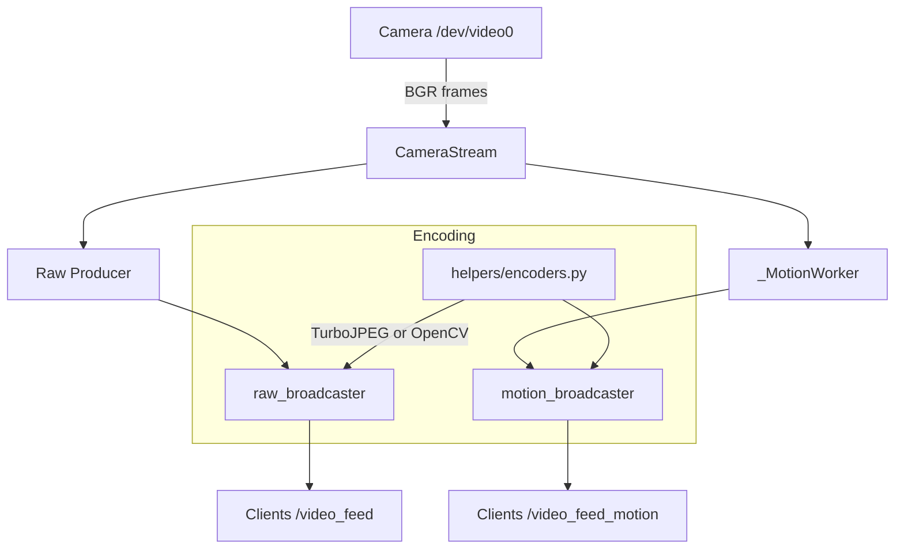

# OpenSentry - LMV (Live Motion Version)

**Turn any Linux device with a camera into a motion detection security system you control.**

Self-hosted. Privacy-first. No cloud required.

[](https://www.python.org/downloads/)
[](https://opensource.org/licenses/MIT)
[](https://www.docker.com/)

---

## 🎯 What is OpenSentry - LMV?

OpenSentry - LMV transforms any Linux device with a webcam into a motion detection security camera. Stream live video with motion detection overlays — all processed locally on your hardware.

### Key Features

- 📹 **Live Video Streaming** - Real-time camera feed with motion detection overlay
- 🚶 **Motion Detection** - MOG2 background subtraction with configurable sensitivity
- 📸 **Snapshot Capture** - Manual snapshots and automatic capture on motion events
- 🌐 **Web Interface** - Clean, dark-themed, mobile-friendly dashboard
- 🔐 **Flexible Authentication** - Local auth or integrate with OAuth2/OIDC providers
- 🔍 **mDNS Discovery** - Auto-discover devices on your network
- 🐳 **Docker Ready** - Deploy anywhere with Docker Compose

---

## 📖 Table of Contents

- [Quick Start](#-quick-start)
- [Architecture](#-architecture)
- [Installation](#-installation)
  - [Run from Source](#run-from-source)
  - [Docker Deployment](#docker-deployment)
- [Authentication](#-authentication)
  - [Local Authentication](#local-authentication-default)
  - [OAuth2 Integration](#oauth2-integration)
- [Configuration](#%EF%B8%8F-configuration)
- [API & Endpoints](#-api--endpoints)
- [Snapshot Features](#-snapshot-features)
- [OAuth2 Setup Guide](#-oauth2-setup-guide)
- [Discovery & mDNS](#-discovery--mdns)
- [Troubleshooting](#-troubleshooting)
- [Related Projects](#-related-projects)

---

## 🚀 Quick Start

### Option 1: Run from Source
```bash
# Clone the repository
git clone https://github.com/Sbussiso/OpenSentry.git
cd OpenSentry

# Start the server
uv run server.py

# Access at http://127.0.0.1:5000
# Default credentials: admin / admin
```

### Option 2: Docker Compose
```bash
# Build and start using the included compose.yaml
DOCKER_HOST=unix:///var/run/docker.sock docker compose -f compose.yaml build --pull
DOCKER_HOST=unix:///var/run/docker.sock docker compose -f compose.yaml up -d

# Tail logs (look for "TurboJPEG enabled for JPEG encoding")
DOCKER_HOST=unix:///var/run/docker.sock docker compose -f compose.yaml logs -f opensentry

# Access at http://127.0.0.1:5000
```
Note:
- If you see a warning about multiple compose files, specifying `-f compose.yaml` avoids ambiguity.
- If you don’t have a camera, set `OPENSENTRY_ALLOW_PLACEHOLDER=1` in `compose.yaml`.

That's it! OpenSentry is now streaming from your camera.

---

## 🏗️ Architecture

OpenSentry is designed for low CPU usage while supporting multiple simultaneous viewers.

- **`server.py`**: App entrypoint. Defines routes, lifecycle, and starts background services.
- **`helpers/camera.py`**: `CameraStream` captures frames from V4L2 (`/dev/video*`) with low-latency settings.
- **`helpers/frame_hub.py`**: `Broadcaster` centralizes encoding and fan-out:
  - Single producer function (`produce_fn`) encodes one JPEG per tick.
  - Single-slot latest-frame buffer drops backlog to keep latency low.
- **`helpers/encoders.py`**: Uses TurboJPEG when available, otherwise OpenCV JPEG.
- **Background workers (in `server.py`)**:
  - `_MotionWorker` detects motion on downscaled frames, draws ROI, and publishes to `motion_broadcaster`.
  - Raw stream uses a lightweight producer to encode frames for `raw_broadcaster`.

### Data flow



### Concurrency & performance

- **Single encode per tick** per stream type (raw/motion), shared by all clients.
- **Latest-frame only** buffer avoids growing queues and keeps latency low.
- **FPS caps** for workers prevent CPU spikes; output width and JPEG quality configurable.
- **TurboJPEG** accelerates JPEG encoding when the native lib is present.
- Optimized for lightweight motion detection with minimal CPU overhead.

---

## 📦 Installation

### Hardware Requirements & Performance Guide

OpenSentry performs real-time motion detection with video streaming, which requires reasonable CPU and memory. Here's what to expect on different hardware:

#### 🖥️ x86_64 / AMD64 (Intel/AMD PCs)
| Hardware | Performance | Notes |
|----------|-------------|-------|
| **Desktop/Laptop** (2+ cores, 4GB+ RAM) | ⭐⭐⭐⭐⭐ Excellent | 30+ fps at 1080p, multiple clients, very smooth |
| **Intel NUC / Mini PC** | ⭐⭐⭐⭐⭐ Excellent | 25-30 fps at 1080p, ideal for production |
| **Old Desktop** (2010+, 2GB RAM) | ⭐⭐⭐⭐ Good | 15-20 fps at 720p, perfectly usable |

#### 🥧 Raspberry Pi Models

| Model | CPU | RAM | Performance | FPS @ 640x480 | FPS @ 1080p | Status |
|-------|-----|-----|-------------|---------------|-------------|--------|
| **Pi Zero W** | 1-core 1GHz ARMv6 | 512MB | ❌ Not Recommended | 1-3 fps | N/A | Too slow, frequent crashes |
| **Pi Zero 2 W** | 4-core 1GHz ARMv8 | 512MB | ⚠️ Marginal | 5-8 fps | N/A | Usable but laggy |
| **Pi 3B** | 4-core 1.2GHz ARMv8 | 1GB | ⭐⭐⭐ Acceptable | 10-15 fps | 5-8 fps | **Minimum recommended** |
| **Pi 3B+** | 4-core 1.4GHz ARMv8 | 1GB | ⭐⭐⭐ Good | 12-18 fps | 8-12 fps | Solid choice |
| **Pi 4 (2GB)** | 4-core 1.5GHz ARMv8 | 2GB | ⭐⭐⭐⭐ Very Good | 20-25 fps | 15-20 fps | Great performance |
| **Pi 4 (4/8GB)** | 4-core 1.8GHz ARMv8 | 4-8GB | ⭐⭐⭐⭐⭐ Excellent | 25-30 fps | 18-25 fps | Recommended for production |
| **Pi 5 (4/8GB)** | 4-core 2.4GHz ARMv8 | 4-8GB | ⭐⭐⭐⭐⭐ Excellent | 30+ fps | 25-30 fps | Best Raspberry Pi option |

#### 📊 Performance Notes

**FPS (Frames Per Second):**
- **30 fps** - Smooth, real-time video (broadcast quality)
- **15-20 fps** - Acceptable, minor stuttering
- **10-15 fps** - Usable for security monitoring
- **<10 fps** - Laggy, frustrating experience

**Optimization Tips for Lower-End Hardware:**
- Use 640x480 resolution (default recommended for Pi 3B/3B+)
- Lower JPEG quality to 60-70% in settings
- Reduce stream FPS to 10-12 in settings
- Keep default configuration: 1 Gunicorn worker with gevent
- Use wired Ethernet instead of WiFi when possible

#### 💡 Our Recommendations

| Use Case | Recommended Hardware | Why |
|----------|---------------------|-----|
| **Budget / Testing** | Raspberry Pi 3B/3B+ | Acceptable performance at ~$25-35 used |
| **Best Value** | Raspberry Pi 4 (2GB) | Great performance at ~$45, good for most setups |
| **Production / Multiple Cameras** | Raspberry Pi 4/5 (4GB+) | Smooth operation, handles multiple clients |
| **Desktop/Server** | Any modern x86_64 PC | Overkill but excellent if you have one available |

#### ⚠️ Not Recommended
- **Raspberry Pi Zero W** - Too slow (1-core ARMv6), will frustrate you
- **Raspberry Pi 1/2** - Outdated, poor performance with modern Python/OpenCV
- **Virtual machines with <2GB RAM** - Motion detection is memory-intensive

#### ✅ Software Requirements
- Python 3.12+ (for source installation)
- Linux with V4L2 camera support (e.g., `/dev/video0`)
- Docker (optional, for containerized deployment)

### Run from Source

```bash
# Install dependencies with uv (recommended)
uv sync

# Or use pip
python3 -m venv .venv
source .venv/bin/activate
pip install -r requirements.txt

# Start the server
uv run server.py
```

Visit **http://127.0.0.1:5000** and log in with `admin/admin`.

### Docker Deployment

#### Using the included compose.yaml

The repo includes a `compose.yaml` preconfigured to map `/dev/video0` and set sane performance defaults. **Optimized for Raspberry Pi and ARM devices.**

```bash
# Build image and start the service
docker compose build --no-cache
docker compose up -d

# Logs and status
docker logs -f opensentry
docker compose ps
```

**First-time setup on Raspberry Pi:**
```bash
# Clone the repo
git clone https://github.com/Sbussiso/OpenSentry.git
cd OpenSentry

# Generate lockfile (uses opencv-python-headless for ARM stability)
uv lock

# Build and start
docker compose build --no-cache
docker compose up -d

# Monitor logs (camera init takes 10-60s on Pi)
docker logs -f opensentry
```

#### Basic Docker Compose

```yaml
services:
  opensentry:
    image: opensentry:latest
    container_name: opensentry
    ports:
      - "5000:5000"
    environment:
      - OPENSENTRY_USER=admin
      - OPENSENTRY_PASS=admin
      - OPENSENTRY_SECRET=please-change-me-in-production
      - OPENSENTRY_PORT=5000
    devices:
      - /dev/video0:/dev/video0
    group_add:
      - video
    restart: unless-stopped
```

```bash
# Build and start
docker compose up -d --build

# View logs
docker logs -f opensentry
```

#### Production Docker Compose

For production deployments with OAuth2:

```yaml
services:
  opensentry:
    build: .
    container_name: opensentry
    ports:
      - "${OPENSENTRY_PORT:-5000}:${OPENSENTRY_PORT:-5000}"
    environment:
      - OPENSENTRY_USER=admin
      - OPENSENTRY_PASS=${OPENSENTRY_PASS}
      - OPENSENTRY_SECRET=${OPENSENTRY_SECRET}
      - OPENSENTRY_PORT=${OPENSENTRY_PORT:-5000}
      - OPENSENTRY_DEVICE_NAME=Front Door Camera
      - OPENSENTRY_API_TOKEN=${API_TOKEN}
      - OPENSENTRY_LOG_LEVEL=INFO
    devices:
      - /dev/video0:/dev/video0
    group_add:
      - video
    volumes:
      - opensentry_config:/app
    restart: unless-stopped

volumes:
  opensentry_config:
```

Create a `.env` file:
```bash
OPENSENTRY_PASS=secure-password-here
OPENSENTRY_SECRET=your-64-char-random-secret
OPENSENTRY_PORT=5000
API_TOKEN=your-api-token-for-status-endpoint
```

---

## 🔐 Authentication

OpenSentry supports two authentication modes: **Local** (simple username/password) and **OAuth2** (enterprise SSO integration).

### Local Authentication (Default)

Simple username/password authentication for quick setups.

**Configuration:**
```bash
# Environment variables
export OPENSENTRY_USER=admin
export OPENSENTRY_PASS=admin
export OPENSENTRY_SECRET=please-change-me
```

**Docker:**
```yaml
environment:
  - OPENSENTRY_USER=admin
  - OPENSENTRY_PASS=secure-password
  - OPENSENTRY_SECRET=random-64-char-secret
```

### OAuth2 Integration

Integrate with external OAuth2/OIDC providers for centralized authentication, SSO, and enterprise identity management.

**Supported Providers:**
- ✅ Custom OAuth2 Server ([see our OAuth2 project](#-related-projects))
- ✅ Keycloak
- ✅ Auth0
- ✅ Okta
- ✅ Google OAuth2
- ✅ Any OIDC-compliant provider

**Benefits:**
- 🏢 **Single Sign-On (SSO)** - One login for all your services
- 🔒 **Centralized Auth** - Manage users in one place
- 📊 **Audit Logging** - Track authentication events
- 🔑 **Advanced Security** - MFA, conditional access, etc.
- 🌐 **Multi-Device** - Consistent auth across all OpenSentry instances

**Configuration via Web UI:**

1. Navigate to **Settings** → **Authentication**
2. Select **"OAuth2 Authentication"**
3. Enter your OAuth2 server details:
   - **Base URL**: `http://127.0.0.1:8000` (or your OAuth2 server address)
   - **Client ID**: `opensentry-device`
   - **Client Secret**: (optional, for confidential clients)
   - **Scope**: `openid profile email offline_access`
4. Click **"Test OAuth2 Connection"** to verify
5. Click **"Save Authentication Settings"**
6. Restart OpenSentry

**Configuration via JSON:**

Edit `config.json`:
```json
{
  "auth": {
    "auth_mode": "oauth2",
    "oauth2_base_url": "http://127.0.0.1:8000",
    "oauth2_client_id": "opensentry-device",
    "oauth2_client_secret": "",
    "oauth2_scope": "openid profile email offline_access"
  }
}
```

**Fallback to Local Login:**

If the OAuth2 server is unavailable, users can access local login via:
```
http://your-opensentry:5000/oauth2/fallback
```

Or click **"Use local login for now"** on the OAuth2 unavailable page.

---

## ⚙️ Configuration

### Environment Variables

| Variable | Description | Default |
|----------|-------------|---------|
| `OPENSENTRY_USER` | Local auth username | `admin` |
| `OPENSENTRY_PASS` | Local auth password | `admin` |
| `OPENSENTRY_SECRET` | Session encryption key (use random 64-char string) | Random (dev only) |
| `OPENSENTRY_PORT` | HTTP port (auto-increments if busy) | `5000` |
| `OPENSENTRY_CAMERA_INDEX` | Preferred camera index | `0` |
| `OPENSENTRY_DEVICE_NAME` | Device display name | `OpenSentry` |
| `OPENSENTRY_LOG_LEVEL` | Logging verbosity (`INFO`, `DEBUG`) | `INFO` |
| `OPENSENTRY_API_TOKEN` | Bearer token for `/status` endpoint | _(none)_ |
| `OPENSENTRY_MDNS_DISABLE` | Disable mDNS advertisement | `0` |
| `OPENSENTRY_VERSION` | Version metadata for discovery | `0.1.0` |
| `GUNICORN_WORKERS` | Number of Gunicorn workers (use 1 to prevent camera contention) | `1` |
| `GUNICORN_WORKER_CLASS` | Worker type: `gevent` for concurrent handling, `sync` for debugging | `gevent` |
| `GUNICORN_TIMEOUT` | Worker timeout in seconds | `60` |
| `OPENCV_VIDEOIO_PRIORITY_LIST` | OpenCV video backend priority | `V4L2` |

### config.json Structure

```json
{
  "device_id": "a7077099be8a",
  "motion_detection": {
    "min_area": 500,
    "pad": 10,
    "mog2_var_threshold": 16,
    "mog2_history": 500
  },
  "snapshots": {
    "enabled": false,
    "cooldown": 15,
    "motion_threshold": 5000,
    "directory": "snapshots"
  },
  "auth": {
    "auth_mode": "local",
    "oauth2_base_url": "",
    "oauth2_client_id": "",
    "oauth2_client_secret": "",
    "oauth2_scope": "openid profile email offline_access"
  },
  "video": {
    "width": 0,
    "height": 0,
    "fps": 15,
    "mjpeg": true
  },
  "stream": {
    "max_width": 960,
    "jpeg_quality": 75,
    "raw_fps": 15
  }
}
```

**Motion Detection Parameters:**
- `min_area` - Minimum contour area in pixels to trigger detection (default: 500)
- `pad` - Padding around detection boxes in pixels (default: 10)
- `mog2_var_threshold` - MOG2 variance threshold: 8-12 for high sensitivity, 18-30 for fewer false positives (default: 16)
- `mog2_history` - Learning period in frames: 200-500 for fast adaptation, 500-1000 for stable scenes (default: 500)

**Automatic Snapshots:**
- `enabled` - Toggle automatic snapshots on motion detection (default: false)
- `cooldown` - Minimum seconds between snapshots to prevent spam (default: 15)
- `motion_threshold` - Minimum total motion area in pixels to trigger snapshot (default: 5000)
- `directory` - Directory to save snapshots, relative to app directory (default: "snapshots")

---

## 🌐 API & Endpoints

### Main Routes

| Endpoint | Description | Auth Required |
|----------|-------------|---------------|
| `/` | Motion detection camera dashboard | ✅ |
| `/video_feed` | Raw camera feed (MJPEG) | ✅ |
| `/video_feed_motion` | Motion detection overlay (MJPEG) | ✅ |
| `/settings` | Configuration page | ✅ |
| `/health` | Health check (200 OK) | ❌ |

### Authentication Routes

| Endpoint | Description |
|----------|-------------|
| `/login` | Local login page |
| `/logout` | Clear session and logout |
| `/oauth2/login` | Initiate OAuth2 authorization flow |
| `/oauth2/callback` | OAuth2 callback handler |
| `/oauth2/fallback` | Enable local login fallback |

### API Routes

| Endpoint | Method | Description | Auth |
|----------|--------|-------------|------|
| `/status` | GET | Device status JSON | Bearer token (if configured) |
| `/api/snapshot` | GET | Capture and download current frame as JPEG | ✅ |
| `/api/oauth2/test` | GET | Test OAuth2 connectivity | ✅ |

**Example `/status` Response:**
```json
{
  "id": "a7077099be8a",
  "name": "OpenSentry",
  "version": "0.1.0",
  "port": 5000,
  "caps": ["raw", "motion"],
  "routes": {
    "raw": true,
    "motion": true
  },
  "camera": {
    "running": true,
    "has_frame": true
  },
  "auth_mode": "session"
}
```

---

## 📸 Snapshot Features

OpenSentry provides two ways to capture snapshots from your camera feed:

### Manual Snapshots

Click the **"Take Snapshot"** button on the main dashboard to instantly download a JPEG image with motion detection overlays.

- **Endpoint:** `/api/snapshot`
- **Format:** JPEG with motion detection boxes and status overlay
- **Filename:** `opensentry-snapshot-YYYY-MM-DD_HH-MM-SS.jpg`
- **Download:** Automatically downloads to your browser's download folder

### Automatic Snapshots

Configure OpenSentry to automatically save snapshots when motion is detected. Perfect for security monitoring and event recording.

**Configuration (Settings Page or config.json):**

```json
"snapshots": {
  "enabled": true,
  "cooldown": 15,
  "motion_threshold": 5000,
  "directory": "snapshots"
}
```

**How It Works:**
1. Motion is detected and total motion area is calculated
2. If motion area exceeds `motion_threshold` (in pixels)
3. And `cooldown` period has elapsed since last snapshot
4. Frame is automatically saved to `snapshots/` directory
5. Filename format: `YYYY-MM-DD_HH-MM-SS_motion.jpg`

**Usage Examples:**

**High Security (Capture Most Motion):**
```json
{
  "cooldown": 5,
  "motion_threshold": 2000
}
```

**Balanced Monitoring (Default):**
```json
{
  "cooldown": 15,
  "motion_threshold": 5000
}
```

**Critical Events Only:**
```json
{
  "cooldown": 60,
  "motion_threshold": 15000
}
```

**Docker Volume Mounting:**
```yaml
volumes:
  - ./snapshots:/app/snapshots  # Persist snapshots on host
```

---

## 🔧 OAuth2 Setup Guide

### Prerequisites

1. **OAuth2 Server Running** - See [our OAuth2 project](https://github.com/Sbussiso/LOauth2) or use your existing provider
2. **Client Registration** - Register OpenSentry as an OAuth2 client

### Step-by-Step Setup

#### 1. Register OpenSentry as OAuth2 Client

For our custom OAuth2 server, use the included registration script:

```bash
# Navigate to OAuth2 server directory
cd ../Oauth2

# Create and run the client registration script
cat > add_opensentry_client.py << 'EOF'
#!/usr/bin/env python3
import os
import sys
os.environ['DATABASE_URL'] = os.environ.get('DATABASE_URL', 'sqlite:///oauth.db')

from server import SessionLocal, OAuth2Client

db = SessionLocal()
existing = db.query(OAuth2Client).filter_by(client_id='opensentry-device').first()

# Space-separated redirect URIs
redirect_uris = 'http://localhost:5000/oauth2/callback http://127.0.0.1:5000/oauth2/callback'
scope = 'openid profile email offline_access'

if existing:
    print("Updating existing client...")
    existing.client_secret = None
    existing.client_name = 'OpenSentry Device'
    existing.redirect_uris = redirect_uris
    existing.scope = scope
    existing.grant_types = 'authorization_code refresh_token'
    existing.response_types = 'code'
    existing.token_endpoint_auth_method = 'none'
    existing.require_consent = True
    db.commit()
    print("✓ Client 'opensentry-device' updated")
else:
    print("Creating new client...")
    client = OAuth2Client(
        client_id='opensentry-device',
        client_secret=None,
        client_name='OpenSentry Device',
        redirect_uris=redirect_uris,
        scope=scope,
        grant_types='authorization_code refresh_token',
        response_types='code',
        token_endpoint_auth_method='none',
        require_consent=True
    )
    db.add(client)
    db.commit()
    print("✓ Client 'opensentry-device' created")

db.close()
EOF

# Run the registration script
uv run python add_opensentry_client.py
```

**Important Configuration Details:**
- **Client Type**: Public (no client secret)
- **Auth Method**: `none` (PKCE required)
- **Redirect URIs**: Must include both `localhost` and `127.0.0.1` variants
- **Grant Types**: `authorization_code`, `refresh_token`
- **Scopes**: `openid profile email offline_access`

#### 2. Configure OpenSentry

**Via Web UI:**
1. Start OpenSentry: `uv run server.py`
2. Navigate to `/settings`
3. Scroll to **Authentication Settings**
4. Select **OAuth2 Authentication**
5. Enter configuration:
   ```
   OAuth2 Server Base URL: http://127.0.0.1:8000
   Client ID: opensentry-device
   Client Secret: (leave empty)
   Scope: openid profile email offline_access
   ```
6. Click **Test OAuth2 Connection** (should show "Success!")
7. Click **Save Authentication Settings**
8. Restart OpenSentry

**Via Configuration File:**

Edit `config.json`:
```json
{
  "auth": {
    "auth_mode": "oauth2",
    "oauth2_base_url": "http://127.0.0.1:8000",
    "oauth2_client_id": "opensentry-device",
    "oauth2_client_secret": "",
    "oauth2_scope": "openid profile email offline_access"
  }
}
```

Restart OpenSentry.

#### 3. Test the Integration

1. Navigate to `http://127.0.0.1:5000`
2. You'll be redirected to the OAuth2 server login
3. Log in with your OAuth2 credentials
4. Approve the consent screen
5. You'll be redirected back to OpenSentry and logged in

**If OAuth2 server is down:**
- You'll see an "OAuth2 Unavailable" page
- Click "Use local login for now" to use basic auth
- Or visit `http://127.0.0.1:5000/oauth2/fallback`

### Multiple OpenSentry Instances

When running multiple OpenSentry devices with OAuth2:

**Option 1: One Client, Multiple Redirect URIs**
```python
redirect_uris = 'http://localhost:5000/oauth2/callback http://localhost:5001/oauth2/callback http://localhost:5002/oauth2/callback'
```

**Option 2: Separate Clients Per Device** (Recommended)
```bash
# Register each device separately
opensentry-garage    → http://192.168.1.10:5000/oauth2/callback
opensentry-front     → http://192.168.1.11:5000/oauth2/callback
opensentry-backyard  → http://192.168.1.12:5000/oauth2/callback
```

Update each OpenSentry's `config.json` with its unique `oauth2_client_id`.

---

## 🔍 Discovery & mDNS

OpenSentry advertises itself on the local network using mDNS (Zeroconf).

### mDNS Service

- **Service Type**: `_opensentry._tcp.local`
- **Port**: Actual bound port (may differ from `OPENSENTRY_PORT` if port was busy)

### TXT Records

| Key | Description | Example |
|-----|-------------|---------|
| `id` | Persistent device ID | `a7077099be8a` |
| `name` | Device display name | `Front Door Camera` |
| `ver` | OpenSentry version | `0.1.0` |
| `caps` | Capabilities | `raw,motion` |
| `auth` | Auth mode | `session` or `token` |
| `api` | Available APIs | `/status,/health` |
| `path` | Web UI path | `/` |
| `proto` | Protocol version | `1` |

### Discovery Tools

Use the companion **OpenSentry Command** project to discover all devices on your network:

```bash
# Clone OpenSentry Command
git clone https://github.com/Sbussiso/OpenSentry-Command.git
cd OpenSentry-Command

# Run discovery
uv run main.py

# Access at http://127.0.0.1:3000
```

See [Related Projects](#-related-projects) for more info.

---

## 🔧 Troubleshooting

### Raspberry Pi / ARM Issues

**Problem**: Workers crash with "code 139" (segmentation fault) on Raspberry Pi

**Solution**: This is fixed in the latest version. If you're still experiencing crashes:

1. **Ensure you have the latest changes**:
   ```bash
   git pull
   rm uv.lock  # Force regeneration with opencv-python-headless
   uv lock
   docker compose build --no-cache
   docker compose up
   ```

2. **Verify compose.yaml has correct configuration**:
   ```yaml
   environment:
     - GUNICORN_WORKERS=1  # Single worker to prevent camera contention
     - GUNICORN_WORKER_CLASS=gevent  # Async worker for concurrent handling
     - OPENBLAS_NUM_THREADS=1
     - OPENCV_VIDEOIO_PRIORITY_LIST=V4L2
   ```

3. **Check that opencv-python-headless is being used**:
   ```bash
   docker exec opensentry pip list | grep opencv
   # Should show: opencv-python-headless (not opencv-python)
   ```

**Root Cause**: Multiple workers + `opencv-python` + OpenBLAS threading causes camera contention and segfaults on ARM. The fix uses:
- `opencv-python-headless` (more stable on ARM)
- Single worker with `gevent` for concurrent request handling
- Single-threaded OpenBLAS

**Problem**: Camera initialization is slow on Raspberry Pi

**Solution**: This is normal. The Pi's camera takes 10-60 seconds to initialize. Check logs:
```bash
docker logs -f opensentry
# Wait for: "INFO opensentry.camera: Opened camera device=/dev/video0"
```

**Problem**: High CPU usage on Raspberry Pi

**Solutions**:
1. Reduce camera resolution in settings (640x480 recommended)
2. Lower JPEG quality to 60-70%
3. Lower stream FPS in settings
4. Keep default configuration (1 worker with gevent handles concurrency efficiently)
5. Reduce motion detection processing frequency
6. Disable automatic snapshots if not needed

### Camera Issues

**Problem**: Camera not detected or streams are blank / `can't open camera by index` error in Docker logs

**Root Cause**: USB cameras often require privileged mode in Docker due to low-level device access requirements.

**Solution #1 (Most Common)**: Enable privileged mode in `compose.yaml`:
```yaml
services:
  opensentry:
    privileged: true  # Required for camera access with some USB cameras
    devices:
      - /dev/video0:/dev/video0
    group_add:
      - video
```

Then restart:
```bash
docker compose down
docker compose up -d
docker logs -f opensentry  # Should see "Opened camera device=/dev/video0"
```

**Other Solutions:**

1. Check camera device exists on host:
   ```bash
   ls -l /dev/video*
   ```

2. Test camera with v4l2:
   ```bash
   sudo apt install v4l-utils
   v4l2-ctl --list-devices
   v4l2-ctl -d /dev/video0 --list-formats-ext
   ```

3. Verify device is not in use:
   ```bash
   lsof /dev/video0
   # If in use, stop other applications using the camera
   ```

4. Check logs:
   ```bash
   # Host
   uv run server.py  # Watch startup logs

   # Docker
   docker logs -f opensentry
   ```

5. Try different camera index:
   ```bash
   export OPENSENTRY_CAMERA_INDEX=1
   uv run server.py
   ```

### Snapshot Issues

**Problem**: Snapshot button hangs/loads forever

**Root Cause**: Using `sync` workers causes blocking - the video stream occupies the worker, preventing snapshot requests from being handled.

**Solution**: Use `gevent` worker class in `compose.yaml` (default configuration):
```yaml
environment:
  - GUNICORN_WORKERS=1  # Single worker to prevent camera contention
  - GUNICORN_WORKER_CLASS=gevent  # Async worker allows concurrent requests
```

Then rebuild and restart:
```bash
docker compose down
docker compose up -d --build
```

**How it works**:
- `gevent` uses greenlets to handle multiple concurrent requests within a single worker
- Video streams and API requests (like snapshots) can be processed simultaneously
- No camera contention since only one worker accesses the camera device

### OAuth2 Issues

**Problem**: "OAuth2 Server Unavailable"

**Solutions:**
1. Verify OAuth2 server is running:
   ```bash
   curl http://127.0.0.1:8000/.well-known/openid-configuration
   ```

2. Check network connectivity from OpenSentry to OAuth2 server

3. Review OAuth2 server logs for errors

4. Use fallback: `http://127.0.0.1:5000/oauth2/fallback`

**Problem**: "Invalid OAuth2 callback" or redirect errors

**Solutions:**
1. Verify redirect URI matches exactly:
   ```bash
   # In OAuth2 client config
   redirect_uris = 'http://localhost:5000/oauth2/callback'

   # Must match OpenSentry's callback URL
   # Format: http://<host>:<port>/oauth2/callback
   ```

2. Include both `localhost` and `127.0.0.1` variants:
   ```bash
   redirect_uris = 'http://localhost:5000/oauth2/callback http://127.0.0.1:5000/oauth2/callback'
   ```

3. For remote access, add your OpenSentry's IP:
   ```bash
   redirect_uris = 'http://192.168.1.10:5000/oauth2/callback'
   ```

**Problem**: "Token exchange failed" (401 error)

**Solutions:**
1. Verify client is registered correctly:
   ```bash
   # Check client configuration
   uv run python -c "from server import SessionLocal, OAuth2Client; \
     db = SessionLocal(); \
     c = db.query(OAuth2Client).filter_by(client_id='opensentry-device').first(); \
     print('Auth method:', c.token_endpoint_auth_method); \
     print('Client secret:', c.client_secret); \
     print('Redirect URIs:', c.redirect_uris)"
   ```

2. Ensure `token_endpoint_auth_method = 'none'` for public clients

3. Verify redirect_uris are stored as **space-separated string**, not JSON array

4. Check OAuth2 server logs for detailed error messages

**Problem**: Session lost during OAuth2 flow

**Solutions:**
1. Ensure `OPENSENTRY_SECRET` is set and consistent:
   ```bash
   export OPENSENTRY_SECRET="your-64-character-random-secret"
   ```

2. Use Docker volumes to persist sessions:
   ```yaml
   volumes:
     - opensentry_config:/app
   ```

3. Check browser cookie settings (ensure cookies enabled)

### Network Issues

**Problem**: mDNS/Zeroconf not working

**Solutions:**
1. Check if Avahi/Bonjour is running:
   ```bash
   sudo systemctl status avahi-daemon
   ```

2. Disable mDNS if not needed:
   ```bash
   export OPENSENTRY_MDNS_DISABLE=1
   ```

3. Docker: Ensure container can broadcast on LAN (use `network_mode: host` or proper bridge config)

### Port Conflicts

**Problem**: Port 5000 already in use

**Solution**: OpenSentry auto-increments to next available port (5001, 5002, etc.)

To force a specific port:
```bash
export OPENSENTRY_PORT=5010
uv run server.py
```

Check actual bound port in logs:
```
[INFO] opensentry: Binding HTTP server on port 5010
```

### Performance Issues

**Problem**: High CPU usage or slow streams

**Solutions:**
1. Reduce camera resolution via `/settings` (640x480 recommended for Raspberry Pi)

2. Lower JPEG quality and stream FPS via `/settings`

3. Increase Docker resource limits:
   ```yaml
   deploy:
     resources:
       limits:
         cpus: '2.0'
         memory: 2G
   ```

4. Use hardware acceleration if available (Raspberry Pi: enable V4L2 hardware encoding)

5. Ensure TurboJPEG is enabled
   - In containers: `libturbojpeg0` is installed by the Dockerfile; it should auto-enable.
   - On host: install PyTurboJPEG and the native lib, then export the path if needed:
     ```bash
     uv add PyTurboJPEG
     # Ubuntu 24.04
     sudo apt-get install -y libturbojpeg libjpeg-turbo8 libjpeg-turbo8-dev
     export TURBOJPEG=/lib/x86_64-linux-gnu/libturbojpeg.so.0
     ```

6. Cap CPU-heavy thread pools (inside Docker already set in compose)
   ```bash
   export OMP_NUM_THREADS=1 OPENBLAS_NUM_THREADS=1 MKL_NUM_THREADS=1 NUMEXPR_NUM_THREADS=1
   ```

7. Use default configuration (1 worker with gevent) for best efficiency
   ```bash
   export GUNICORN_WORKERS=1
   export GUNICORN_WORKER_CLASS=gevent
   ```

8. If network constrained, reduce `JPEG_QUALITY` and `OUTPUT_MAX_WIDTH` via `/settings`

---

## 🔗 Related Projects

### OpenSentry Command
**Device Discovery & Management Dashboard**

Central dashboard to discover, monitor, and manage all OpenSentry devices on your network.

- 🔍 Auto-discover devices via mDNS
- 📊 Network scanning and device status
- 🌐 Unified access to all cameras
- 🔐 OAuth2 integration for SSO

[View Project →](https://github.com/Sbussiso/OpenSentry-Command)

### LOauth2 (OAuth2 Server)
**Self-Hosted OAuth2 / OIDC Authorization Server**

Complete OAuth2/OIDC server for centralized authentication across all your services.

- 🔒 Enterprise-grade security (PKCE, refresh tokens, RS256)
- 🎛️ Admin UI for client management
- 🌐 Standards-compliant (OAuth 2.0, OIDC)
- 🚀 Production-ready

[View Project →](https://github.com/Sbussiso/LOauth2)

**Quick Setup with OpenSentry:**
```bash
# 1. Start OAuth2 server
cd ../Oauth2
uv run server.py

# 2. Register OpenSentry client (see OAuth2 Setup Guide above)

# 3. Configure OpenSentry to use OAuth2 (via /settings)
```

---

## 🤝 Contributing

Contributions welcome! Whether it's bug reports, feature requests, or code contributions.

- 🐛 **Report bugs**: [Open an issue](https://github.com/Sbussiso/OpenSentry/issues)
- 💡 **Request features**: [Start a discussion](https://github.com/Sbussiso/OpenSentry/discussions)
- 🔧 **Submit code**: Fork, develop, and create a pull request

---

## 📄 License

MIT License - See [LICENSE](LICENSE) for details.

**Free to use, modify, and deploy anywhere.**

---

## 🛡️ Security Best Practices

### For Production Deployments

- [ ] Change default credentials (`OPENSENTRY_USER`, `OPENSENTRY_PASS`)
- [ ] Generate strong random `OPENSENTRY_SECRET` (64+ characters)
- [ ] Use HTTPS with reverse proxy (nginx, Traefik, Caddy)
- [ ] Set up `OPENSENTRY_API_TOKEN` for `/status` endpoint protection
- [ ] Enable OAuth2 for centralized authentication
- [ ] Regular backups of `config.json`
- [ ] Keep dependencies updated (`uv sync` or `pip install --upgrade`)
- [ ] Monitor logs for unauthorized access attempts
- [ ] Use firewall rules to restrict access to trusted networks
- [ ] Disable mDNS in production (`OPENSENTRY_MDNS_DISABLE=1`)

### HTTPS Setup with Nginx

```nginx
server {
    listen 443 ssl http2;
    server_name opensentry.example.com;

    ssl_certificate /path/to/cert.pem;
    ssl_certificate_key /path/to/key.pem;

    location / {
        proxy_pass http://127.0.0.1:5000;
        proxy_set_header Host $host;
        proxy_set_header X-Real-IP $remote_addr;
        proxy_set_header X-Forwarded-For $proxy_add_x_forwarded_for;
        proxy_set_header X-Forwarded-Proto $scheme;

        # WebSocket support for live streams
        proxy_http_version 1.1;
        proxy_set_header Upgrade $http_upgrade;
        proxy_set_header Connection "upgrade";
    }
}
```

---

## 🌟 Why OpenSentry?

- ✅ **Privacy-First** - All processing happens locally, no cloud required
- ✅ **Self-Hosted** - You control your data and infrastructure
- ✅ **Lightweight** - Focused on motion detection for efficient resource usage
- ✅ **Flexible Authentication** - Start simple, scale with OAuth2/SSO
- ✅ **Network Discovery** - Auto-discover devices via mDNS
- ✅ **Open Source** - Audit, modify, and extend as needed
- ✅ **Production-Ready** - Used in real-world deployments
- ✅ **Free Forever** - MIT license, no hidden costs

---

<p align="center">
  <strong>Take control of your motion detection camera system.</strong><br>
  <em>Self-hosted. Private. Yours.</em>
</p>

<p align="center">
  <a href="#-quick-start">Get Started →</a> |
  <a href="#-oauth2-setup-guide">OAuth2 Setup →</a> |
  <a href="#-related-projects">Related Projects →</a>
</p>
